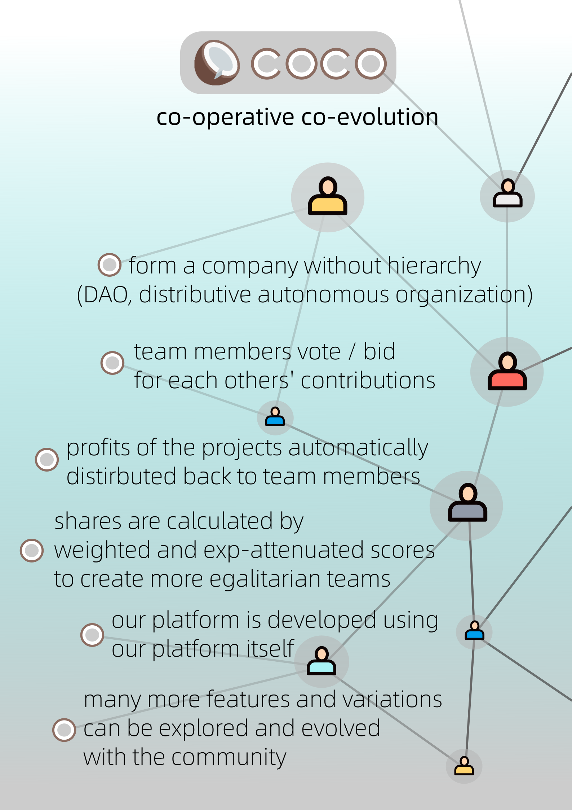
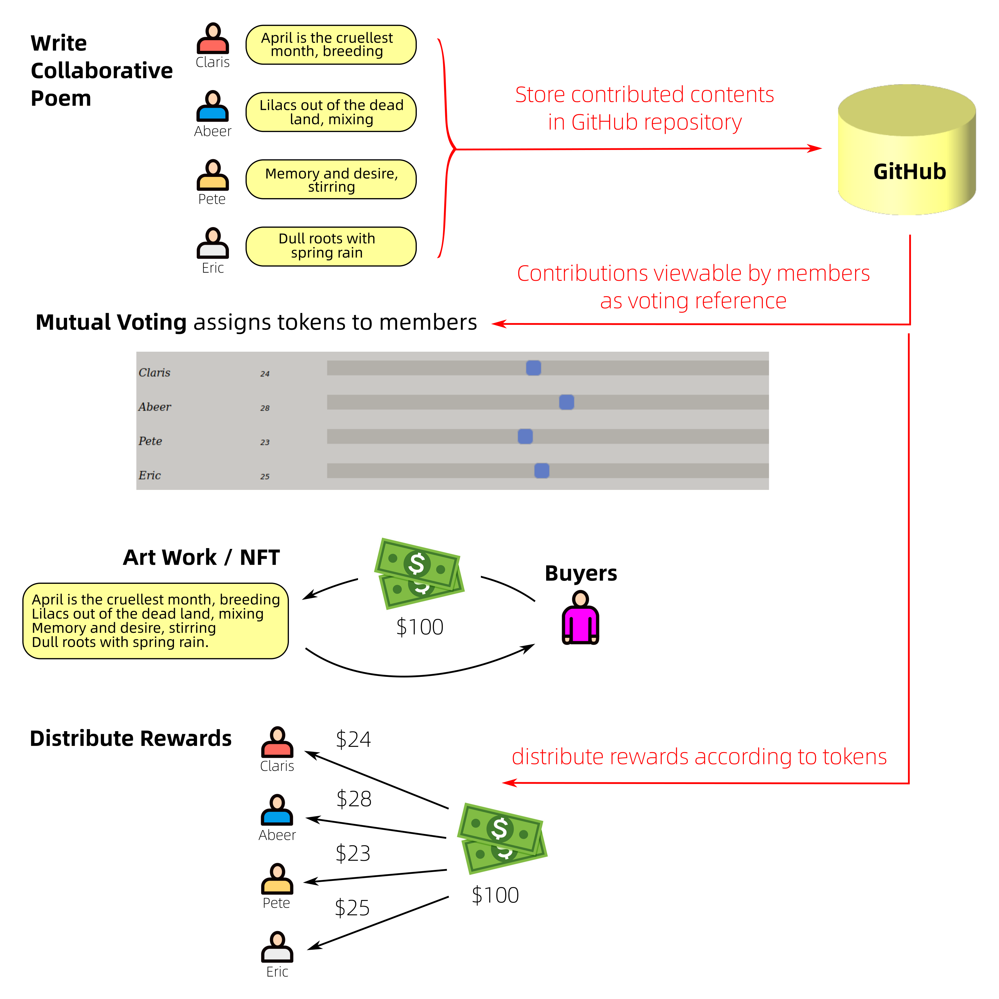

 

# COCO collaborative platform (world-wide version)

## Introduction

Coco is a decentralized, autonomous, anonymous or named, open-source, for-profit, platform for online collaborative projects based on virtual shares. 

Main features:

 

(The China version uses real names and no cryptocurrency, to conform to Chinese regulations.)

Coco's name comes from "co-operative co-evolution", a kind of evolutionary algorithm for machine learning (This is merely an inspiration, Coco does not actually use this algorithm).

 

Update: The new [technical white paper](technical-white-paper-EN.html) is in HTML form and contains demos of UI's that you can play with.

We have created a DAO blockchain (based on Ethereum) using the Aragon platform.  Our DAO will utilize this blockchain to store credits of members.

The project has also been renamed "Snow Crossing", from a children's story by Japanese writer Miyazawa.  (I will explain this later.)

This is Coco's [white paper draft](docs/COCO-white-paper-en.pdf).  The draft is not finalized;  it contains tentative ideas and other loose ends.  In fact, the problem that Coco tries to solve is known as "corporate governance" which is a big subject in its own right.  It is unlikely to have a simple unique answer.  In other words, Coco is an open experiment.

## Development plan

We will use the "agile" development methodology, adding features continually.  We won't provide a "final" list of features, as Coco is very complex and the features have to be evolved through users' experimentation.

Also, Coco will be developed as a project inside Coco itself.

* v0.1 -- "Let's write poems together"
* v0.2 -- Draw diagrams collaboratively
* v0.3 -- Write code collaboratively
* v0.4 -- Experiment on voting / bidding
* v0.5 -- visualization of "contribution tree"
* v1.0 -- release version

## v0.1 "Let's write poems together"

Requirements:

* Let members register/log into Coco
* Members can create projects (poems)
* Other interested members can add a line to the poem
* Record each member's contributions in a Git repository   
  (the repository may be local, not necessarily Github)
* When poem finished, let members vote on each other's contributions / scores
* Use a simple HTML slide-rule for voting (already has code for this)

## v0.2 -- Draw diagrams collaboratively

* Draw diagrams or pictures in SVG format
* GUI allows to draw lines, arrows, circles, rectangles, colors, texts, etc.
* Allow to import externally-created SVG files

## v0.3 -- Write code collaboratively

* Create documents in a Git repository  
 (this part is essentially completed by the previous 2 versions)
* Allow branching of projects

## v0.4 -- Experiment on voting / bidding

* Experiment on voting and bidding schemes
* End-product users may also vote (eg. the readers of poems)

## v0.5 -- Visualization of "contributions tree"

* Allows to visually examine each member's contributions
* Visualize a project (with branches) as a tree

## Other matters

* Find lawyer to draft an open-source for-profit license for Coco projects (similar to License Zero)
* Start a crowd-funding campaign for the Coco platform  
 (actually Coco itself is a crowd-funding platform)
* Business promotion / advertising